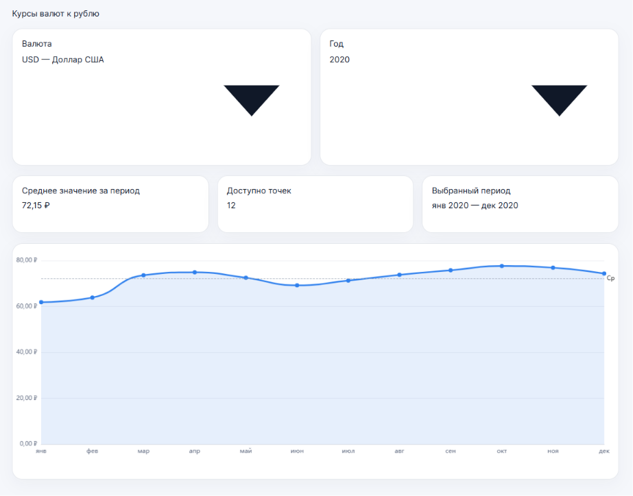

# Решение задания 2 - визуализация курсов валют

## Реализованный функционал

### Отображение графика

Реализована визуализация курса валют с использованием библиотеки ECharts.

График поддерживает:

* отображение значений по месяцам;
* адаптивное масштабирование;
* отображение среднего значения за период;
* отображение значений при наведении на точку графика.

---

### Tooltip

При наведении на точку графика отображается всплывающая подсказка со значением курса в выбранный месяц.

---

### Переключение валют

Реализован выбор валюты через компонент Select из библиотеки Consta UI Kit.

Поддерживаются следующие валюты:

* USD
* EUR
* CNY

После выбора валюты график автоматически перестраивается.

---

### Выбор года

**Дополнительно реализован выбор года через компонент Select.**

Поддерживаются годы с 2016 по 2025. После изменения года выполняется повторная загрузка данных и обновление графика.

---

### Информационные карточки

На дашборде отображаются:

* среднее значение курса за выбранный период;
* количество доступных точек данных;
* отображаемый период.

---

### Работа с API

Дополнительно реализовано получение данных из внешнего API.

Для загрузки исторических данных используется сервис Frankfurter API.

Полученные данные преобразуются в формат, необходимый для построения графика.

---

## Структура проекта

```text
src/
├── data/
│   └── data.ts
│
├── echarts/
│   └── ReactECharts.tsx
│
├── utils/
│   └── rates.ts
│
├── App.tsx
├── App.css
└── index.tsx
```

---

## Запуск проекта

Установка зависимостей:

```bash
npm install
```

Запуск приложения:

```bash
npm start
```

Сборка production-версии:

```bash
npm run build
```

---

## Дополнительная информация

В процессе выполнения были внесены небольшие отклонения от первоначального ТЗ.

### Дополнительно реализовано

* выбор года для просмотра исторических данных;
* загрузка данных из внешнего API;
* автоматическое обновление визуализации при изменении параметров.

### Что требует дальнейшей доработки

Основной функционал реализован полностью.

При этом визуальная часть может быть дополнительно улучшена:

* надо более точное соответствие макету из Figma, я пока работал в основном над функционалом;
* улучшение визуального оформления элементов управления и карточек.

Текущая версия проекта ориентирована в первую очередь на **демонстрацию работоспособности**.

---

## Результат

Визуал приложения представлен ниже:



Реализовано приложение для анализа курсов валют относительно рубля с возможностью:

* выбора валюты;
* выбора года;
* просмотра исторической динамики;
* отображения статистики по выбранному периоду;
* интерактивного взаимодействия с графиком.
